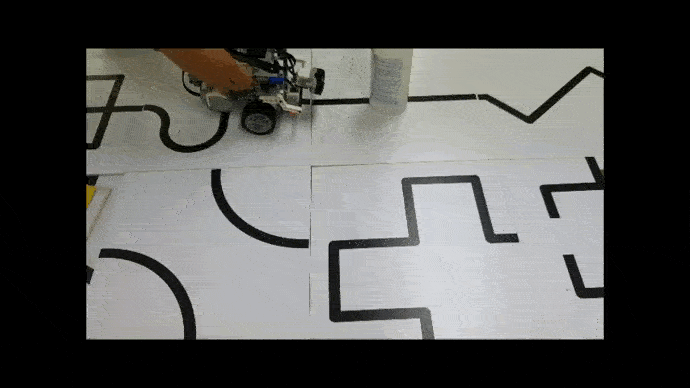
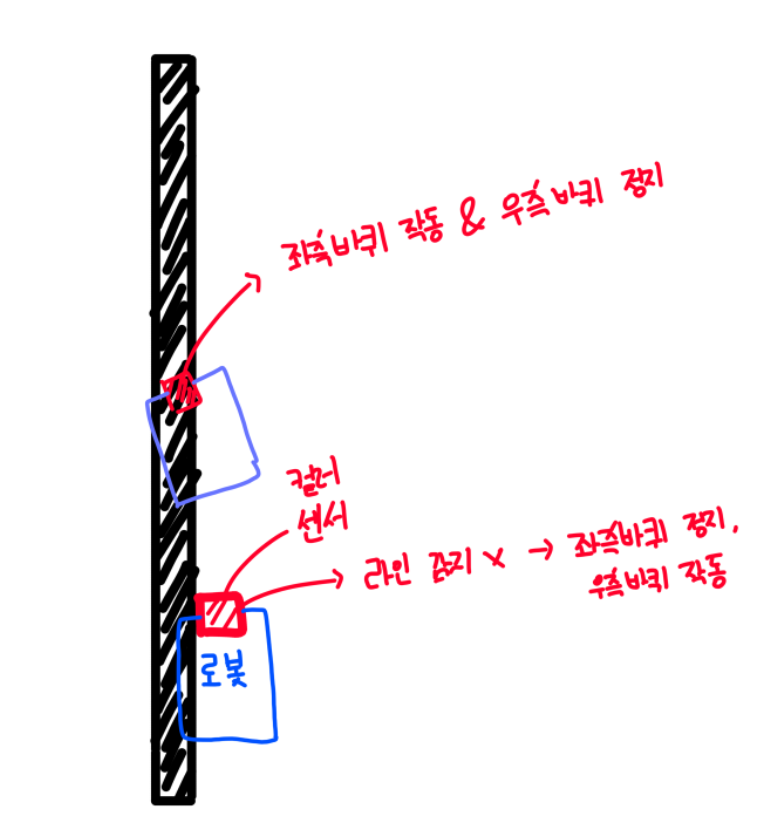

# line-tracer-robotc

### 라인 트레이서 로봇

-------------

교내 로봇 소프트웨어 방과후 활동 때 만든 거

앞에 장애물이 있으면 울트라 소닉 센서(초음파 센서)를 통해 감지하여, 이를 피해간 뒤,

다시 라인으로 복귀하여 라인을 따라 이동하는 로봇임

#

### ▼ 미리보기

</img>

#

### ▼ 대략적인 알고리즘

-----------------------------------------

총 2개가 장착되어있는 컬러 센서를 통해 바닥의 라인을 감지하고, 

모든 컬러 센서가 라인을 감지하거나, 하나의 컬러 센서만 라인을 감지했거나를 체크하여

모터의 속도 값을 조정해서 이동하는 방식

**(코드에 주석이 일일히 달려있으므로, 참고 바람)**

https://github.com/ABER1047/line-tracer-robotc/blob/main/index.cpp

#

### ▼ 참고

-----------------------------------------

라인 트레이서 알고리즘은 원센서 라인 트레이서 코드를 기반으로 작성 되었음. (물론 본인이 만든거 ㅇㅇ)

원센서 라인 트레이서 알고리즘은 위 알고리즘과 마찬가지로

센서가 바닥의 색을 감지해, 라인이 감지되었을 경우, 우측 바퀴를 움직이고

아닌경우, 왼쪽 바퀴만 움직이는 식으로 작동함.

 

**▼ 자세한건 아래 그림 참고**

</img>

 

**▼ 해당 방법을 기반으로 작성된 코드**

https://github.com/ABER1047/line-tracer-robotc/blob/main/onecensor_linetracer.c

